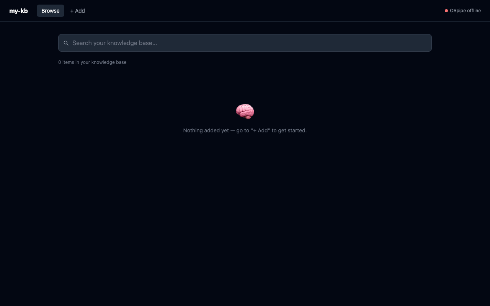

# my-kb

A personal knowledge base with semantic search, built on [OSpipe](https://github.com/) (via `ospipe-server`).



## Stack

- **Client** — React + Vite + Tailwind (`client/`)
- **Server** — Express + TypeScript (`server/`)
- **Backend** — OSpipe REST server (semantic search & storage), data stored locally at `~/.ospipe`

## Prerequisites

- Node.js 18+
- Rust toolchain (`cargo`) — to build/run `ospipe-server`
- A local checkout of [`ruvector`](https://github.com/) containing the `ospipe-server` binary

## Setup

1. Install dependencies for the root, server, and client:

   ```bash
   npm run install:all
   ```

2. Start the OSpipe backend (in the `ruvector` repo):

   ```bash
   cd ~/code/ruvector
   cargo run --bin ospipe-server --release
   ```

   This serves the OSpipe REST API at `http://localhost:3030`. It must be running before you start the server or client.

3. In a separate terminal, from the `my-kb` root, start the server and client together:

   ```bash
   npm run dev
   ```

   - Server: `http://localhost:3031`
   - Client: `http://localhost:5173`

   Or run them individually with `npm run dev:server` / `npm run dev:client`.

## Verifying it's working

```bash
curl http://localhost:3030/health   # OSpipe backend
curl http://localhost:3031/api/health   # my-kb server (reports OSpipe connectivity too)
```

Then open `http://localhost:5173` — you should see "OSpipe connected" in the top right.

## OSpipe API (via the my-kb server)

| Method | Path            | Description                  |
|--------|-----------------|-------------------------------|
| POST   | `/api/ingest`   | Add content to the knowledge base |
| GET    | `/api/search?q=`| Semantic search                |
| GET    | `/api/health`   | Server + OSpipe status         |

## Project structure

```
client/    React frontend
server/    Express API, OSpipe client, ingestion routes
scripts/   One-off ingestion scripts
```

## Production build

```bash
npm run build   # builds client, then server
npm start       # serves the built client from the server on :3031
```

## Notes

- All data is local — no cloud, no auth required.
- Your actual knowledge base content lives at `~/.ospipe`, not in this repo.
